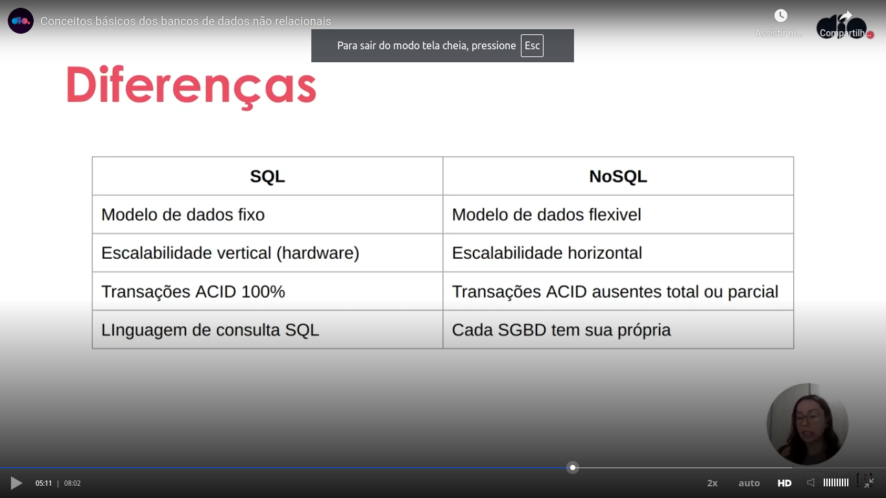
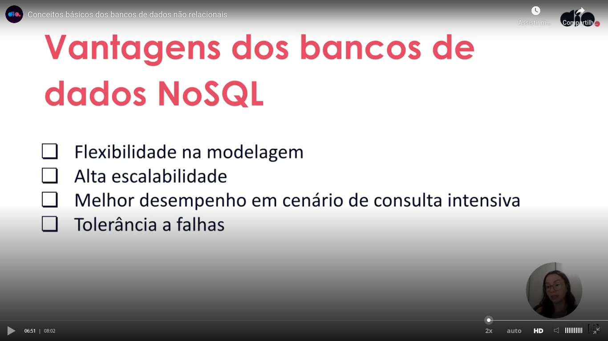
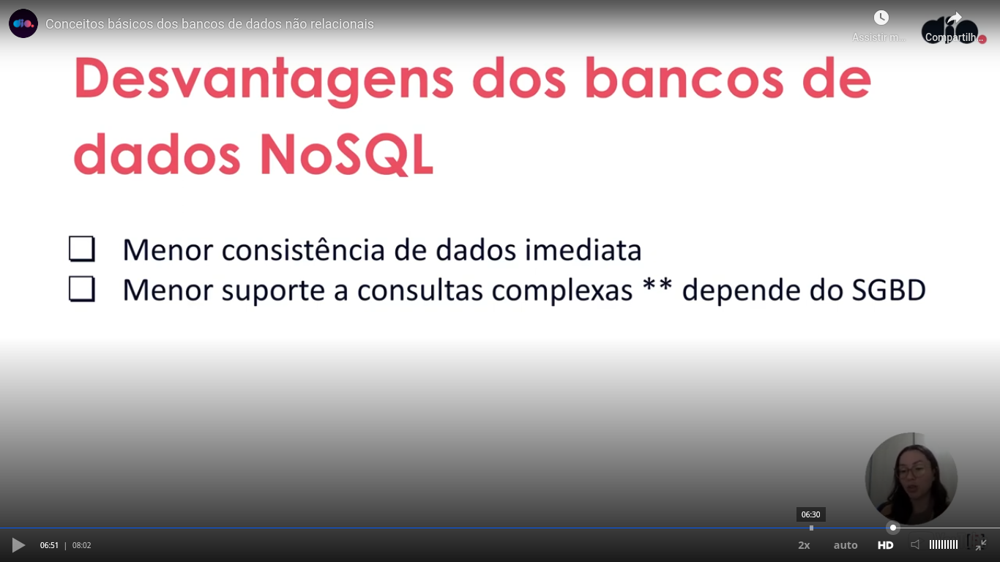
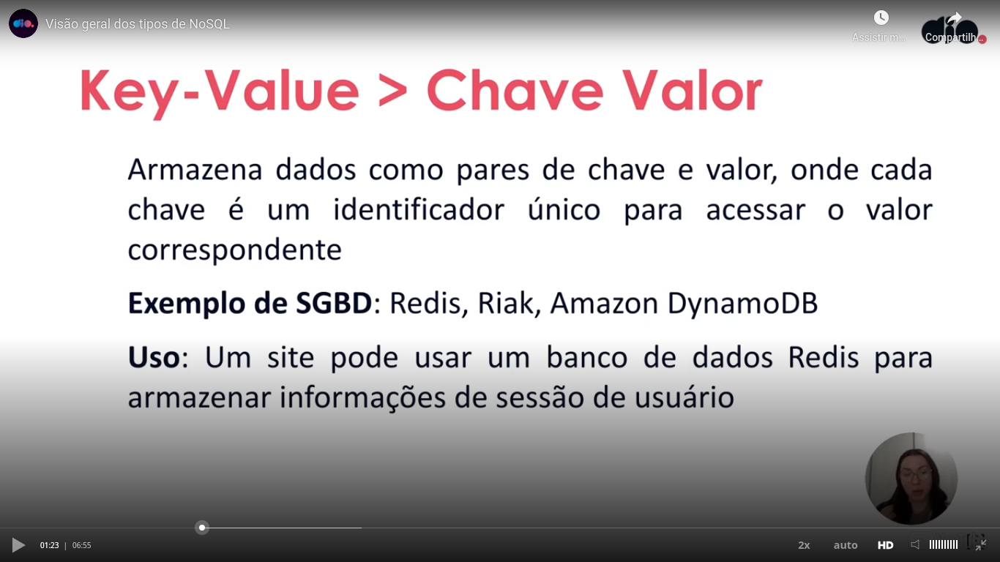
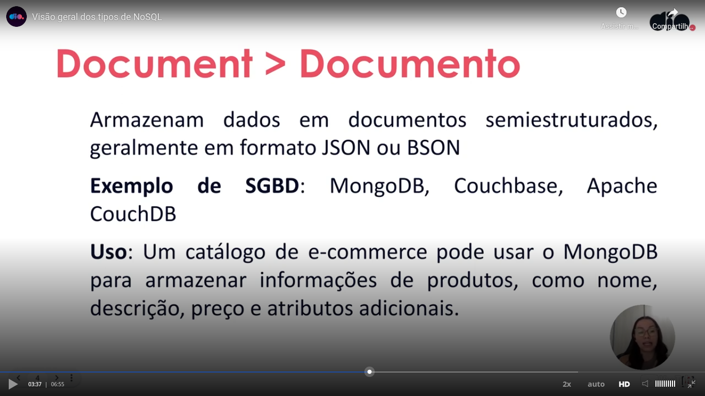
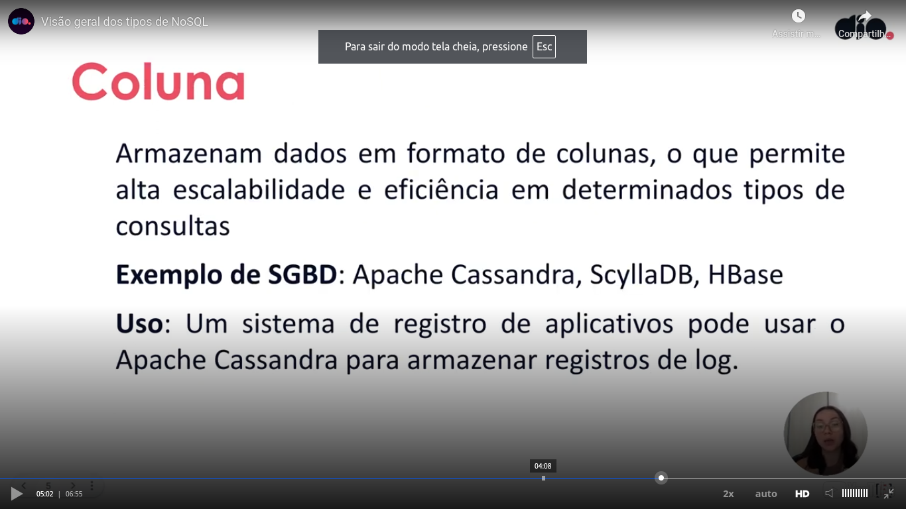
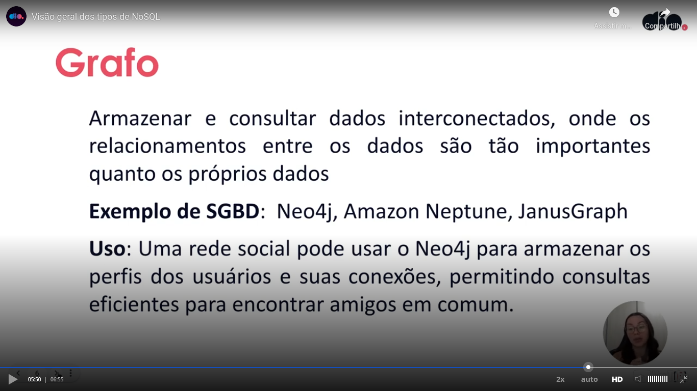
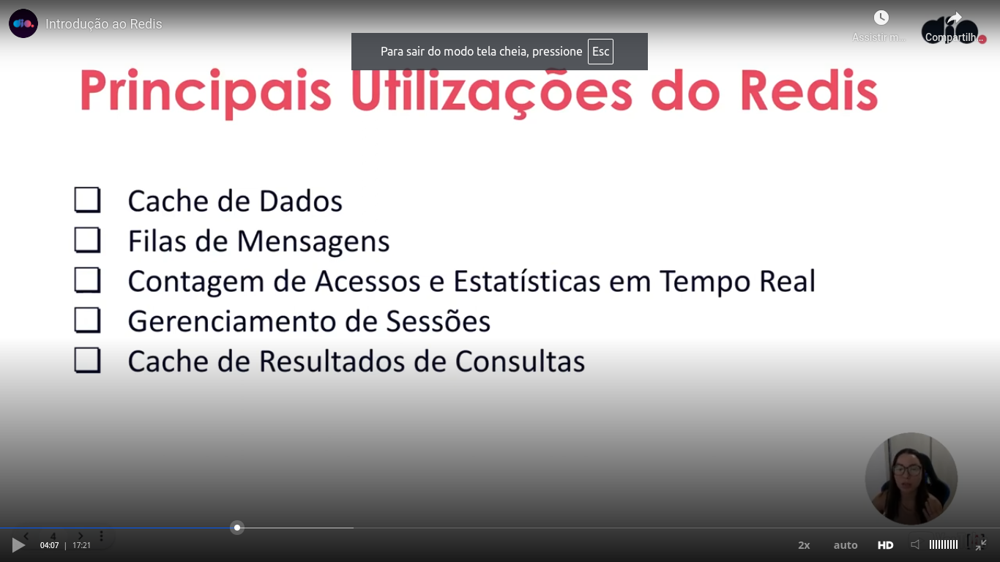
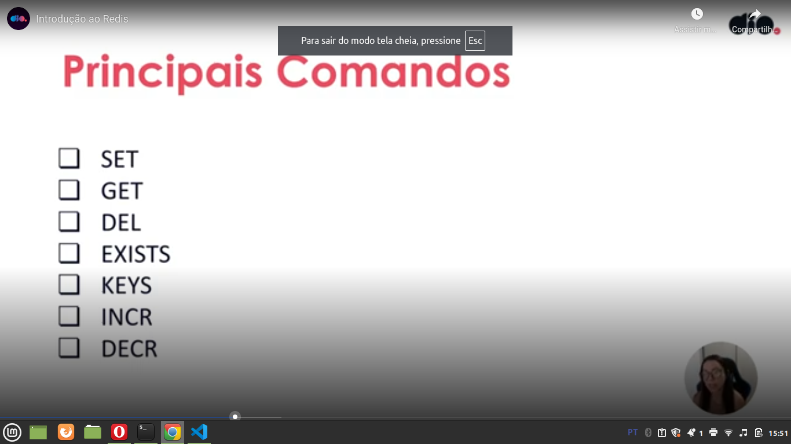

# Eventual consistency

Teacher talked about that besides de other differences, one difference in relation to SQL databases is related to consistency. Imagine a RDBMS relational traditional SQL server cluster. When a new information need to be replicated, it needs to be replicated in time it is be inserted and in a NoSQL world this is not a constraint. Maybe when you get an information, maybe this information is different in another server because it was not replicated yet. This is called eventual consistency.

# Differences between SQL ans NoSQL databases

# A advantages and disadvantages

!
# Key-value type of NoSQL databases

Characteristics:

- Quick because the access is based in the desired key and because this databases works in memmory;
- Good for horizontal scaling;
- Example of use: session management, pub/sub systems and cache;

# Document type of NoSQL databases

Characteristics:

- Does not demand a rigid structure of the data;
- Easy edition of the schema based on the user document;
- Efficient queries;
- Complex data modeling;
- Used as example on e-commerce catalogs because the schema can vary, different informations (structure) can be stored.

# Column type of NoSQL databases

Characteristics:

- Good for horizontal scaling;
- Flexible schema;
- Efficient data retrieve;
- Used as example in logs.

# Graph type of NoSQL databases

Characteristics:

- The relation in data is so important as the data. As example in social networks. This way we can search in a optimized way the friends in common in social networks.

# MongoBD

Teacher talked about aggregation pipelines, that this is a more complex subject.

# Redis

Is a databas system that stores the information **in memmory**, used to **cache** as example. Speed is a characteristics of Redis.

When the teacher talked about the flexible data structure, she talked about the capacity of Redis to store an array, a string or a number as example.

Comparing to document based, in this case the SGDB can store a document that have a key and a value. In a SGDB like Redis, the SGDB is based on a key and a value. In another words, the keys maybe have no relation, in a document based the keys are related based on the document itself.

As Redis have the **pub/sub** characteristic, if we make a **simple** comparison, we can define Redis as equivalent to pub/sub system, RabbitMQ as example.

Main uses of Redis:

Main commands of Redis:

